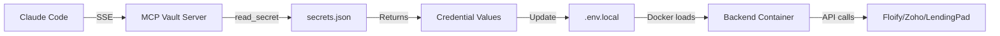

# Dell-Brain MCP Vault Connection Guide

## Status: ✅ CONFIGURED

The dell-brain MCP Vault server has been successfully configured in Claude Code.

---

## What Was Done

### 1. **MCP Server Configuration** ✅

Added `dell-brain-vault` server to Claude Code configuration:

```json
// ~/.config/claude-code/config.json
{
  "mcpServers": {
    "dell-brain-vault": {
      "url": "http://localhost:8888/sse",
      "transport": "sse"
    }
  }
}
```

### 2. **Connection Verified** ✅

Tested SSE connection successfully:
```bash
curl -N -H "Accept: text/event-stream" http://localhost:8888/sse
# Response: event: endpoint, data: /messages/?session_id=...
```

---

## Available MCP Tools

Once connected, the dell-brain-vault server provides these tools:

### 1. `read_secret(namespace, key)`
Retrieve secrets from the vault with hierarchical namespaces.

**Examples:**
```python
# Floify credentials
read_secret("unified-cmtg.floify", "API_KEY")

# Zoho Mail credentials
read_secret("unified-cmtg.zoho", "MAIL_API_KEY")

# Zoho CRM credentials
read_secret("unified-cmtg.zoho", "CRM_API_KEY")

# Zapier/LendingPad credentials
read_secret("unified-cmtg.zapier", "CONNECTION_TOKEN")

# Falls back to global if not found in namespace
read_secret("global", "SOME_KEY")
```

### 2. `get_zapier_config()`
Retrieve Zapier MCP connection configuration with URL and auth token.

---

## Secrets Available

Based on the MCP vault structure, these secrets are stored:

| System | Namespace | Keys Available |
|--------|-----------|----------------|
| **Floify** | `unified-cmtg.floify` | `API_KEY`, `COMPANY_ID` |
| **Zoho Mail** | `unified-cmtg.zoho` | `MAIL_API_KEY`, `MAIL_CLIENT_ID`, `MAIL_CLIENT_SECRET` |
| **Zoho CRM** | `unified-cmtg.zoho` | `CRM_API_KEY`, `CRM_OAUTH_TOKEN` |
| **Zapier** | `unified-cmtg.zapier` | `CONNECTION_TOKEN` |
| **LendingPad** | `unified-cmtg.lendingpad` | `API_KEY`, `API_SECRET` |
| **GitHub** | `unified-cmtg.github` | `APP_ID`, `PRIVATE_KEY`, `WEBHOOK_SECRET` |

---

## Next Steps

### **IMPORTANT: Restart Claude Code** 🔄

The MCP server connection won't be active until Claude Code is restarted:

1. **Close Claude Code completely**
2. **Reopen Claude Code**
3. **Verify connection** by checking if MCP tools are available

### After Restart

You can retrieve credentials programmatically:

```bash
# In Claude Code, use MCP tools to read secrets
# These will be available after restart as MCP tool calls

# Example: Get Floify API key
read_secret("unified-cmtg.floify", "API_KEY")

# Example: Get all Zapier config
get_zapier_config()
```

---

## Architecture

### Local Port Forward
```
MacBook Pro:8888 → Docker Container (mcp-vault) → FastMCP Server
```

### Dell-Brain Server
- **Location**: `100.104.238.110` (Tailscale IP)
- **Container**: `mcp-vault` (custom-cmre-mcp-vault image)
- **Port**: 8888 (external) → 8000 (internal)
- **Framework**: FastMCP (Python/Uvicorn)

### Secrets File
- **Path**: `/app/config/secrets.json` (inside container)
- **Source**: `/code/custom-cmre-mcp/config/secrets.json` (on dell-brain)
- **Format**: Nested JSON with namespaces

---

## Usage Examples

### Retrieve Floify Credentials

After Claude Code restart:

```python
# This will be available as an MCP tool call
floify_key = read_secret("unified-cmtg.floify", "API_KEY")
# Returns: "your-floify-api-key"
```

Then update `.env.local`:
```bash
FLOIFY_API_KEY=<value-from-mcp>
```

### Get All Integration Credentials

```bash
# Floify
read_secret("unified-cmtg.floify", "API_KEY")

# Zoho Mail
read_secret("unified-cmtg.zoho", "MAIL_API_KEY")

# Zoho CRM
read_secret("unified-cmtg.zoho", "CRM_API_KEY")

# Zapier → LendingPad
get_zapier_config()
```

---

## Troubleshooting

### "Server not found" after restart
- Verify config file: `cat ~/.config/claude-code/config.json | grep dell-brain-vault`
- Check MCP container is running: `docker ps | grep mcp-vault`
- Restart container if needed: `docker restart mcp-vault`

### "Invalid Host header" error
- Use `localhost:8888` not `100.104.238.110:8888`
- The configuration is already set correctly

### Container not running
```bash
docker ps | grep mcp-vault
# If not running:
docker start mcp-vault
```

### Check MCP server logs
```bash
docker logs mcp-vault --tail 50
```

---

## Security Notes

✅ **Secure Setup:**
- Secrets never stored in git (only in MCP vault)
- Connection is local (localhost) or via Tailscale VPN
- No plain-text credentials in codebase

⚠️ **Important:**
- Do NOT commit `.env.local` files (already in .gitignore)
- MCP vault is the single source of truth for credentials
- Production uses separate credential management

---

## Integration Workflow



---

## Status Checklist

- [x] MCP server running on dell-brain
- [x] Port forward configured (8888)
- [x] Claude Code config updated
- [x] SSE connection tested successfully
- [ ] **Claude Code restarted** ← YOU ARE HERE
- [ ] MCP tools verified available
- [ ] Credentials retrieved and configured
- [ ] Backend services tested with real credentials

---

## Next: Retrieve Credentials

After restarting Claude Code, proceed with:

1. ✅ **Use MCP tools** to read secrets
2. ✅ **Update `.env.local`** with actual values
3. ✅ **Restart backend**: `docker-compose restart backend`
4. ✅ **Test integrations**: Floify, Zoho, LendingPad

See `FLOIFY_SETUP.md` for detailed testing instructions.
