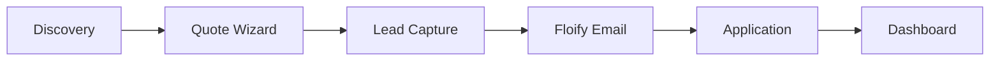

# Product Requirements Document (PRD)
## Unified CMTG Platform v2.0

**Version**: 2.0  
**Last Updated**: 2026-01-11  
**Status**: APPROVED

---

## 1. Executive Overview

The **Unified CMTG** project consolidates two legacy systems:
1. **custommortgage** (WordPress): Content, SEO, and Marketing.
2. **cmtgdirect** (Django): Loan Pricing Engine and API.

### The Solution: A Headless Architecture

| Layer | Technology | Purpose |
|-------|------------|---------|
| **Frontend** | Next.js 14 (React) | Premium, fast user experience |
| **Backend** | Django | Pricing logic and API |
| **CMS** | Wagtail | Headless content management |
| **Orchestration** | AI Agents | Rate sheets, content, automation |

### Domain Strategy

| Phase | Domain | Status |
|-------|--------|--------|
| Development | `cmre.c-mtg.com` | Build here |
| Parallel Run | Both live | Test traffic |
| Cut-over | `custommortgageinc.com` | Final home |

> **SEO Parity**: All URLs must match 1:1 with WordPress before cut-over.

---

## 2. Tool & Agent Usage Guide

This project uses a specific set of AI-native tools:

### 🛠️ Gemini CLI (`.gemini/`)
The central nervous system. Use it to switch contexts and run meta-commands.
- **Context**: "I am working on the Pricing Engine." → Agents load `pricing/` context.
- **Memory**: Stores project decisions in `GEMINI.md` (read-only for humans, write for agents).

### 🤖 Agent Conductor Roles

| Agent | Specialty | Focus Areas |
|-------|-----------|-------------|
| **Pricing Engineer** | Python/Django | `cmtgdirect` logic, `QualifyView`, matching |
| **Wagtail Expert** | CMS modeling | StreamFields, page models, content API |
| **Frontend Architect** | Next.js/React | Components, API clients, Tailwind |
| **Rate Sheet Agent** | PDF extraction | OCR, LLM parsing, validation |
| **QA Tester** | Testing | pytest, Docker, E2E tests |

### 🎼 Conductor (`conductor/`)
The workflow engine. Defines sequences of tasks agents execute.
- **Tracks**: Long-running processes (e.g., "Rate Sheet Extraction")
- **Usage**: Access via slash commands or automated triggers
  - `/ratesheets sync`: Triggers the Rate Sheet Agent track
  - `/migrate content`: Triggers WordPress → Wagtail migration

---

## 3. Project Organization

```
unified-cmtg/
├── GEMINI.md                    # Agent context file
├── README.md                    # Project overview
├── PRD.md                       # THIS FILE
│
├── knowledge-base/              # Reference documentation
│   ├── rate_extraction_field_mapping.md
│   ├── ratesheet_extraction_sop.md
│   └── archive-v1/              # Old v1 documentation
│
├── unified-platform/            # MAIN APPLICATION
│   ├── .agent/                  # Agent definitions
│   ├── conductor/               # Workflow orchestration
│   │   └── tracks/              # Workflow definitions
│   ├── backend/                 # Django + Wagtail
│   │   ├── config/              # Settings (base, dev, prod)
│   │   ├── api/                 # DRF endpoints
│   │   ├── cms/                 # Wagtail page models
│   │   ├── pricing/             # Loan matching logic
│   │   └── ratesheets/          # Agentic ingestion
│   ├── frontend/                # Next.js 14+
│   │   ├── app/                 # App Router pages
│   │   ├── components/          # Design system
│   │   └── lib/                 # API clients
│   └── scripts/                 # Utility scripts
│
├── FLOIFY-API/                  # Floify integration docs
└── Ratesheet-samples/           # Sample rate sheets
```

---

## 4. Implementation Plan

### Phase 1: Foundation & Legacy Verification (Week 1)

**Goal**: Get legacy apps running locally, then initialize the new stack.

| Task | Description | Status |
|------|-------------|--------|
| Legacy Run | Start `cmtgdirect` in Docker on dell-brain | ⏳ |
| Verification | Confirm cmtgdirect API is responding | ⏳ |
| Repo Setup | Initialize `unified-platform` structure | ✅ |
| Backend | Dockerize Django + Wagtail | ⏳ |
| Frontend | Initialize Next.js 14 + Tailwind | ✅ |
| Connectivity | Verify Next.js can fetch from Django API | ⏳ |

---

### Phase 2: The Core Pricing Engine (Week 2)

**Goal**: Port `cmtgdirect` logic to the new structure.

| Task | Description | Source → Target |
|------|-------------|-----------------|
| Models | Port Lender, LoanProgram | `loans/models/` → `pricing/models.py` |
| Logic | Port QualifyView matching | `api/views.py` → `pricing/services.py` |
| Enhancement | Implement RateAdjustment model | NEW - FICO × LTV grids |
| API | Expose `/api/v1/quote` | DRF endpoint |

**Key Files to Port**:
```
cmtgdirect/loans/queries.py        → get_matched_loan_programs_for_qual()
cmtgdirect/loans/models/programs.py → Lender, LoanProgram, BaseLoan
cmtgdirect/loans/models/program_types.py → ProgramType, LenderProgramOffering
cmtgdirect/api/views.py            → QualifyView
```

---

### Phase 3: Content Migration (Week 3)

**Goal**: Move WordPress content into Wagtail.

| Task | Description |
|------|-------------|
| Modeling | Create Wagtail `ProgramPage` matching 64 ACF fields |
| Extraction | Update `agent_tools.py` to dump WP content to JSON |
| Import | Django management command to ingest JSON → Wagtail |
| Verification | Ensure URLs match (`/programs/{slug}`) |

**WordPress ACF Structure (64 fields, 6 tabs)**:
- Location Tab (23 fields) - For local pages
- Program Info Tab (8 fields) - Core data
- Financial Terms Tab (7 fields) - Rates, LTV
- Program Details Tab (7 fields) - Content blocks
- Property & Loan Tab (8 fields) - Property types
- Borrower Details Tab (4 fields) - Eligibility

---

### Phase 4: The Rate Sheet Agent (Week 4)

**Goal**: Automate ingestion of Excel/PDF rate sheets.

| Task | Description |
|------|-------------|
| Ingestion | Build script to read `Ratesheet List.csv` |
| Extraction | Connect Gemini 1.5 Pro to parse PDF → JSON |
| Pipeline | Build `IngestionPipeline` class in Django |
| Review UI | "Approve Rates" dashboard in Django Admin |

**Pipeline Flow**:
```
CSV/Email → Download PDF → OCR → LLM Parse → Staging Table → Human Review → Publish
```

---

### Phase 5: Floify Integration & Frontend (Week 5)

**Goal**: Connect "Apply Now" button and user dashboard.

| Task | Description |
|------|-------------|
| Lead Push | Implement `floify_create_prospect()` |
| Webhook | Handle `application.created` from Floify |
| UI | Build Quote Wizard and Rate Table in Next.js |

**Floify Flow**:
```
Quote Wizard → Lead Capture → POST /prospects → Floify Email → Application → Webhook → Dashboard
```

---

## 5. User Journeys

### 5.1 Borrower Journey



| Step | Action | System |
|------|--------|--------|
| 1 | Finds program via search/AI | Wagtail CMS |
| 2 | Quote Wizard (existing logic) | Django |
| 3 | Chatbot captures email, phone | Gemini API |
| 4 | `POST /prospects` creates app | Floify API |
| 5 | Floify sends application link | Floify |
| 6 | Borrower completes on Floify | Floify |
| 7 | Webhook triggers Django sync | Django |
| 8 | Status visible on platform | Django |

### 5.2 Rate Sheet Agent Workflow

```mermaid
flowchart TB
    CSV[Ratesheet CSV] --> Agent[Browser Agent]
    Email[ratesheets@c-mtg.com] --> Parser[Email Parser]
    Agent --> PDF[Download PDF]
    Parser --> PDF
    PDF --> OCR[OCR/LLM Extract]
    OCR --> JSON[Structured Rates]
    JSON --> Validate[Human Review Queue]
    Validate --> DB[LenderProgramOffering]
```

---

## 6. Data Models

### 6.1 Existing Models (Port from cmtgdirect)

```python
class Lender(TimestampedModel):
    company_name = CharField(max_length=500)
    include_states = ChoiceArrayField(USStateField())
    company_website = URLField()
    company_email = EmailField()

class LoanProgram(BaseLoan):
    lender = ForeignKey(Lender)
    min_credit = PositiveSmallIntegerField()
    max_loan_to_value = FloatField()
    min_dscr = FloatField()
    property_types = ChoiceArrayField(...)
    occupancy = ChoiceArrayField(...)
    purpose = ChoiceArrayField(...)

class LenderProgramOffering(TimestampedModel):
    lender = ForeignKey(Lender)
    program_type = ForeignKey(ProgramType)
    min_rate = FloatField()
    max_rate = FloatField()
    min_fico = PositiveSmallIntegerField()
    max_ltv = FloatField()
    rate_sheet_url = URLField()
```

### 6.2 New Models (To Implement)

```python
class RateAdjustment(TimestampedModel):
    """LLPA adjustments from rate sheets."""
    offering = ForeignKey(LenderProgramOffering)
    adjustment_type = CharField(choices=[
        ('fico_ltv', 'Credit Score / LTV'),
        ('purpose', 'Loan Purpose'),
        ('occupancy', 'Occupancy Type'),
        ('property_type', 'Property Type'),
    ])
    row_min = FloatField()  # e.g., FICO 720
    row_max = FloatField()  # e.g., FICO 739
    col_min = FloatField()  # e.g., LTV 70.01
    col_max = FloatField()  # e.g., LTV 75.00
    adjustment_points = FloatField()  # e.g., -0.625
```

---

## 7. Success Metrics

| Metric | Target |
|--------|--------|
| URL Parity | 100% match with WordPress |
| Rate Sheet Freshness | Daily updates |
| Quote Accuracy | ±0.25% of lender sheet |
| Lead Capture Rate | +30% vs current |
| Page Load Time | < 2 seconds |

---

## 8. Red Team Analysis

### ✅ Resolved Issues

| Issue | Resolution |
|-------|------------|
| "Why Wagtail?" | cmtgdirect has no CMS. Wagtail is headless-native. |
| Rate sheet complexity | Using staging table with human review |
| Missing code confusion | Legacy code clearly documented in `legacy/` |
| Local verification | Added Phase 1 legacy verification step |

---

## 9. Approval

- [x] User approves headless architecture
- [x] User approves v2 PRD
- [ ] Begin Phase 1 implementation

---

*Version 2.0 - Last Updated: 2026-01-11*
