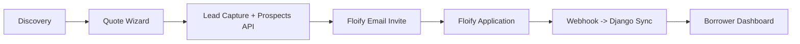

# Product Requirements Document (PRD)
## Unified CMTG Platform v2.0

**Version**: 2.0  
**Last Updated**: 2026-01-11  
**Status**: REDTEAMED & REFINED

---

## 1. Executive Summary

Build a unified Django+Wagtail platform at `cmre.c-mtg.com` that:
- Consolidates WordPress content + Django pricing/application backend
- Implements AI-first user experience (chatbot, voice agent)
- Automates Lender Rate Sheet ingestion via agentic workflows
- Provides a seamless hand-off to Floify for applications

### Domain Strategy
| Phase | Domain | Status |
|-------|--------|--------|
| Development | `cmre.c-mtg.com` | Build here |
| Parallel Run | Both live | Test traffic |
| Cut-over | `custommortgageinc.com` | Final home |

> **SEO Parity**: All URLs must match 1:1 with WordPress before cut-over.

---

## 2. User Journeys

### 2.1 Borrower Journey



| Step | Action | System |
|------|--------|--------|
| 1. Discovery | Finds program via search/AI | Wagtail CMS |
| 2. Quote Wizard | `QualifyingFormWizard` (existing Django) | Django |
| 3. Lead Capture | Chatbot/Form captures email, phone | Gemini API |
| 4. Floify Push | `POST /prospects` creates incomplete app | Floify API |
| 5. Email Invite | Floify sends link to applicant | Floify |
| 6. Application | Borrower completes on `custommortgage.floify.com` | Floify |
| 7. Webhook Sync | `application.created` triggers Django sync | Django |
| 8. Dashboard | Borrower sees status on unified platform | Django |

> **Clarification**: Borrowers apply on Floify servers (`custommortgage.floify.com`). They receive an email link from Floify to continue their application. Django acts as the "pre-application" and "post-application" context hub.

### 2.2 Agentic Ratesheet Workflow

```mermaid
flowchart TB
    subgraph Input Sources
        CSV[Ratesheet CSV] --> Agent[Browser Agent]
        Email[ratesheets@c-mtg.com] --> Parser[Email Parser]
    end
    Agent --> PDF[Download PDF]
    Parser --> PDF
    PDF --> OCR[OCR/LLM Extract]
    OCR --> JSON[Structured Rates]
    JSON --> Validate[Human Review Queue]
    Validate --> DB[LenderProgramOffering + RateAdjustment]
```

**Two Ingestion Methods**:
1. **Web Scraping**: Browser agent visits URLs from CSV, downloads PDFs.
2. **Email Parsing**: Monitor `ratesheets@c-mtg.com` (Zoho alias) for PDF attachments.

| Step | Action | Tool |
|------|--------|------|
| 1. Input | Read `Ratesheet List - Ratesheets.csv` | Python |
| 2. Scrape | Browser agent visits lender URLs | Antigravity |
| 3. Download | Fetch PDFs (handle auth if needed) | Browser |
| 4. Extract | OCR + LLM parses rate matrices | Gemini/Claude |
| 5. Validate | Human reviews before publish | Admin UI |
| 6. Sync | Update `LenderProgramOffering` model | Django |

**Existing Data Model** (from `cmtgdirect`):
```python
class LenderProgramOffering(TimestampedModel):
    lender = ForeignKey(Lender)
    program_type = ForeignKey(ProgramType)
    min_rate = FloatField()         # <-- Target field
    max_rate = FloatField()         # <-- Target field
    min_points = FloatField()       # <-- Target field
    max_points = FloatField()       # <-- Target field
    rate_sheet_url = URLField()     # <-- Source URL
    last_rate_update = DateTimeField()  # <-- Track freshness
```

---

## 3. Quote Engine Deep Dive

### 3.1 Existing Logic (Reuse)

The `cmtgdirect` project already has:
- **`QualifyingFormWizard`**: Multi-step form (purpose, purchase/refi, address, loan_info)
- **`QualifyView`** (`POST /api/v1/qualify/`): Matches programs based on:
  - State availability
  - Loan amount range (min/max)
  - Credit score minimum
  - LTV within limits
  - Property type match
  - Loan purpose match
  - Occupancy match

### 3.2 Rate Adjustments (To Implement)

Most lender rate sheets include "LLPA" (Loan Level Price Adjustments). We need:

| Adjustment | Fields |
|------------|--------|
| Credit Score | Higher score = lower rate |
| LTV | Higher LTV = higher rate |
| Property Type | Condos/MF = higher rate |
| Loan Purpose | Cash-out = higher rate |
| Lock Period | Longer lock = higher rate |

**Proposed Model**:
```python
class RateAdjustment(TimestampedModel):
    offering = ForeignKey(LenderProgramOffering)
    adjustment_type = CharField()  # 'fico', 'ltv', 'property', etc.
    min_value = FloatField()       # e.g., 700
    max_value = FloatField()       # e.g., 719
    adjustment_bps = IntegerField() # e.g., +25 (basis points)
```

### 3.3 UI Strategy

| Option | Pros | Cons |
|--------|------|------|
| Skin Django Wizards | Reuses logic, fast | Less "premium" feel |
| Headless API + React | Premium UI | Logic duplication risk |
| **Hybrid** (Recommended) | Best of both | Moderate complexity |

**Hybrid Approach**:
1. Use Django forms for validation and business logic.
2. Create API endpoints that return form schema as JSON.
3. Build React components that consume the schema.
4. Submit back to Django for processing.

---

## 4. Floify Integration Workflow

### 4.1 Lead Capture → Prospects API

```python
# When chatbot/form captures lead:
floify_client.create_prospect({
    "firstName": "John",
    "lastName": "Doe",
    "email": "john@example.com",
    "mobilePhoneNumber": "555-1234",
    "loanAmount": 500000
})
# Returns: prospect_id, Floify sends email to borrower
```

### 4.2 Webhook → Django Sync

```python
# api/views.py - floify_webhook
@api_view(['POST'])
def floify_webhook(request):
    event = request.data.get('event')
    
    if event == 'application.created':
        # Pull full 1003 JSON
        app_data = floify_client.get_1003_json(loan_id)
        # Create/update local Application model
        Application.objects.update_or_create(
            floify_id=loan_id,
            defaults=app_data
        )
    
    if event == 'application.submitted':
        # Notify LO, update dashboard
        pass
```

### 4.3 Borrower Dashboard

After webhook sync, the borrower can see on the unified platform:
- Application status (from Floify)
- Documents requested
- Conditions outstanding, etc.

---

## 5. Site Structure

```
cmre.c-mtg.com/
├── /                           # Homepage
├── /programs/                  # Program directory
│   └── /programs/{slug}/       # Program detail
├── /quote/                     # Quote Wizard (Django forms)
├── /funded-loans/              # Funded loans showcase
├── /blog/                      # Daily AI-generated news
├── /apply/                     # → Redirect to Floify
├── /dashboard/                 # Borrower dashboard (post-apply)
└── /api/                       # REST API
```

---

## 6. Task Breakdown (Revised)

### Phase 1: Setup (Week 1)
- [ ] Create `cmre/` project, install Wagtail
- [ ] Configure Docker Compose
- [ ] Set up CI/CD

### Phase 2: Content Migration (Week 2)
- [ ] WP content extractor (programs, blogs, locations)
- [ ] Import to Wagtail with 1:1 URL slugs
- [ ] Migrate Media Library (user-uploaded only)

### Phase 3: Quote Engine (Week 3)
- [ ] Port `QualifyingFormWizard` to unified app
- [ ] Skin forms with Tailwind
- [ ] Create `RateAdjustment` model
- [ ] Build headless API endpoints

### Phase 4: Floify Integration (Week 4)
- [ ] Implement `POST /prospects` lead push
- [ ] Build `floify_webhook` handler
- [ ] Sync 1003 JSON to local `Application` model
- [ ] Create Borrower Dashboard views

### Phase 5: Ratesheet Agent (Week 5)
- [ ] Build CSV reader for lender list
- [ ] Browser agent to download PDFs
- [ ] OCR/LLM extraction pipeline
- [ ] Human review queue UI
- [ ] Sync to `LenderProgramOffering`

### Phase 6: Chatbot & Polish (Week 6)
- [ ] Integrate Gemini chatbot widget
- [ ] Connect chatbot to lead capture
- [ ] Final UI polish
- [ ] Deploy to `cmre.c-mtg.com`

---

## 7. Success Metrics

| Metric | Target |
|--------|--------|
| URL Parity | 100% |
| Rate Sheet Freshness | Daily update |
| Quote Accuracy | ±0.25% of lender sheet |
| Lead Capture Rate | +30% vs current |
| Application Started → Funded | Track conversion |

---

## 8. Approval

- [ ] User approves this PRD
- [ ] Generate implementation tickets
- [ ] Begin Phase 1
