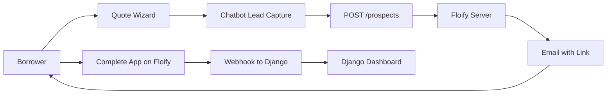

# PRD v2 Simplified: MVP-First Approach

**Version**: 2.0-SIMPLIFIED  
**Last Updated**: 2026-01-11  
**Principle**: Ship a functional system first, then expand

---

## MVP Scope (6 Weeks)

### What We Ship

```
cmre.c-mtg.com/
├── /                    # Homepage
├── /programs/{slug}/    # Program pages (migrated from WP)
├── /funded-loans/       # Funded loans (migrated)
├── /blog/               # Blog (migrated)
├── /quote/              # Quote Engine (existing Django forms)
├── /apply/              # → Floify email redirect
└── /dashboard/          # Borrower status (post-Floify)
```

### MVP Features

| Feature | In MVP? | Notes |
|---------|---------|-------|
| Content migration from WP | ✅ | 1:1 URL parity |
| Quote Wizard (skinned Django forms) | ✅ | Reuse `QualifyingFormWizard` |
| Floify lead push (`POST /prospects`) | ✅ | Chatbot captures, Floify emails link |
| Floify webhook sync | ✅ | Sync 1003 data to Django |
| Borrower Dashboard | ✅ | View status after applying |
| Chatbot widget | ✅ | Gemini API |
| Daily blog via agent | ✅ | Automation win |
| Agentic Ratesheet Scraper | ✅ | Core differentiator |
| Voice agent | ❌ | Phase 2 |
| Community/forum | ❌ | Phase 2 |
| Local program pages | ❌ | Phase 2 (100s of pages) |

---

## Floify Workflow (Clarified)



**Key Points**:
1. Borrower starts on our site (Quote Wizard / Chatbot).
2. We push lead to Floify via API.
3. **Floify sends the email** with application link (`custommortgage.floify.com`).
4. Borrower completes application on Floify (not our servers).
5. Webhook triggers Django sync for dashboard display.

---

## Ratesheet Agent (Priority Feature)

### Input
CSV file: `Ratesheet List - Ratesheets.csv`
```
Lender,Emailed,PW,Type,Ratesheet Link
Acra Non Prime,N,none,NonQM,https://acralending.com/.../acra-ws-ratematrix-1stTDs.pdf
...
```

### Pipeline
1. **Browser Agent** visits URLs, downloads PDFs.
2. **OCR/LLM** extracts rate matrices → JSON.
3. **Human Review** approves changes.
4. **Django Sync** updates `LenderProgramOffering.min_rate`, `max_rate`, etc.

### Target Model
```python
class LenderProgramOffering:
    min_rate = FloatField()
    max_rate = FloatField()
    min_points = FloatField()
    max_points = FloatField()
    rate_sheet_url = URLField()
    last_rate_update = DateTimeField()

class RateAdjustment:  # NEW
    offering = ForeignKey(LenderProgramOffering)
    adjustment_type = CharField()  # 'fico', 'ltv', etc.
    min_value = FloatField()
    max_value = FloatField()
    adjustment_bps = IntegerField()
```

---

## Quote Engine (Reuse Existing)

**Existing in `cmtgdirect`**:
- `QualifyingFormWizard`: Multi-step form with conditional steps
- `QualifyView`: API endpoint that matches programs

**Skin with Tailwind**: Keep Django logic, update CSS for premium look.

---

## Week-by-Week Tasks

| Week | Focus | Key Deliverables |
|------|-------|------------------|
| 1 | Setup | Unified project, Docker, CI/CD |
| 2 | Content | WP migration, URL parity |
| 3 | Quote | Port forms, Tailwind skin, API |
| 4 | Floify | Prospects API, webhook, dashboard |
| 5 | Ratesheet | Agent pipeline, OCR, human review |
| 6 | Polish | Chatbot, deploy to cmre |

---

## Success Criteria

| Metric | Target |
|--------|--------|
| All WP content migrated | 100% |
| URLs match old site | 100% |
| Quote engine works | Yes |
| Chatbot responds | Yes |
| Ratesheet agent updates daily | Yes |
| Site loads | < 2s |

---

## Approval

- [ ] User approves MVP scope
- [ ] Begin Week 1 tasks
