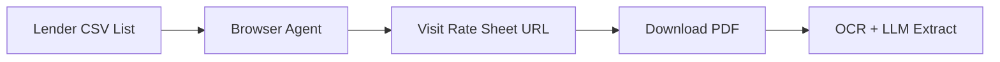
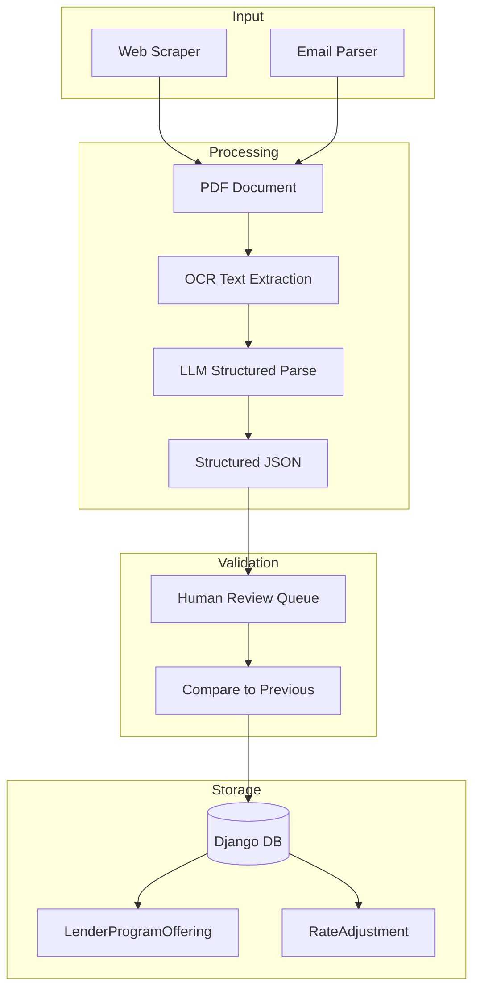

# Rate Sheet Extraction & Pricing SOP

**Version**: 1.0  
**Last Updated**: 2026-01-11

---

## 1. Overview

This document defines the Standard Operating Procedure for:
1. Extracting rate data from lender PDFs (web or email)
2. Applying Loan-Level Price Adjustments (LLPAs)
3. Calculating final borrower rate and cost

---

## 2. Rate Sheet Ingestion Sources

### 2.1 Web-Based Rate Sheets


### 2.2 Email-Based Rate Sheets (NEW)
```mermaid
flowchart LR
    Email[ratesheets@c-mtg.com] --> Zoho[Zoho Mail]
    Zoho --> Parser[Email Parser Agent]
    Parser --> Attach[Extract PDF Attachment]
    Attach --> OCR[OCR + LLM Extract]
```

**Implementation**:
- Create Zoho alias: `ratesheets@c-mtg.com`
- Use Zoho API or n8n to monitor inbox
- Extract PDF attachments matching known lender patterns
- Route to same OCR pipeline as web-scraped PDFs

---

## 3. Rate Sheet Structure (Common Patterns)

Based on review of sample rate sheets (Acra, BluePoint, FundLoans, AD Mortgage):

### 3.1 Base Rate Matrix
Most rate sheets have a primary matrix structured as:

| Term | 30-Day Lock | 45-Day Lock | 60-Day Lock |
|------|-------------|-------------|-------------|
| 7.000% | 100.250 | 100.125 | 100.000 |
| 7.125% | 100.500 | 100.375 | 100.250 |
| 7.250% | 100.750 | 100.625 | 100.500 |
| ... | ... | ... | ... |

**Key Concepts**:
- **Rate Column**: Interest rate (e.g., 7.000%)
- **Price Column**: Points/credits (100.000 = par, >100 = credit, <100 = cost)
- **Lock Period**: 30, 45, 60-day locks

### 3.2 LLPA Grids (Loan Level Price Adjustments)

#### FICO x LTV Matrix
| FICO / LTV | ≤60% | 60.01-65% | 65.01-70% | 70.01-75% | 75.01-80% |
|------------|------|-----------|-----------|-----------|-----------|
| ≥780 | 0.000 | 0.000 | 0.000 | -0.250 | -0.500 |
| 760-779 | 0.000 | 0.000 | -0.125 | -0.375 | -0.625 |
| 740-759 | -0.125 | -0.250 | -0.375 | -0.500 | -0.750 |
| 720-739 | -0.250 | -0.375 | -0.500 | -0.625 | -1.000 |
| 700-719 | -0.375 | -0.500 | -0.625 | -0.875 | -1.250 |
| 680-699 | -0.500 | -0.750 | -0.875 | -1.125 | -1.500 |
| 660-679 | -0.750 | -1.000 | -1.250 | -1.500 | -2.000 |

*Negative values = cost (subtract from price)*

#### Other LLPA Categories
| Category | Adjustments |
|----------|-------------|
| Property Type | SFR: 0, Condo: -0.25, 2-4 Unit: -0.50, 5+ Unit: -0.75 |
| Occupancy | Owner: 0, Second Home: -0.25, Investment: -0.75 |
| Loan Purpose | Purchase: 0, Rate/Term Refi: 0, Cash-Out: -0.50 |
| Loan Amount | <$100K: -0.50, $100-200K: -0.25, $200K+: 0 |
| DSCR (for investment) | ≥1.25: 0, 1.00-1.24: -0.50, <1.00: -1.00 |
| Prepay Penalty | 5yr: +0.50, 3yr: +0.25, None: 0 |

---

## 4. Rate Calculation Formula

```
Final Price = Base Price + FICO/LTV Adj + Property Adj + Occupancy Adj 
              + Purpose Adj + Amount Adj + DSCR Adj + Prepay Adj
```

### 4.1 Example Calculation

**Scenario**:
- Rate: 7.250%
- Lock: 30-day
- FICO: 720
- LTV: 75%
- Property: Condo
- Occupancy: Investment
- Purpose: Cash-Out
- Loan Amount: $350,000
- DSCR: 1.15

**Calculation**:
1. Base Price (7.250%, 30-day): 100.750
2. FICO/LTV (720, 75%): -0.625
3. Property (Condo): -0.250
4. Occupancy (Investment): -0.750
5. Purpose (Cash-Out): -0.500
6. Amount ($350K): 0.000
7. DSCR (1.15): -0.500

**Final Price**: 100.750 - 0.625 - 0.250 - 0.750 - 0.500 - 0.500 = **98.125**

**Interpretation**: 
- 98.125 means 1.875 points cost (100 - 98.125)
- On $350K loan: 1.875% × $350,000 = **$6,562.50** in lender fees

---

## 5. Data Fields to Extract

### 5.1 From Rate Sheets → Django Models

| Rate Sheet Data | Django Field | Model |
|-----------------|--------------|-------|
| Lender Name | `lender.company_name` | Lender |
| Program Name | `program_type.name` | ProgramType |
| Min Rate | `min_rate` | LenderProgramOffering |
| Max Rate | `max_rate` | LenderProgramOffering |
| Base Price at Par | (derive from matrix) | Custom calc |
| Lock Period Options | (new field needed) | LenderProgramOffering |
| FICO/LTV Matrix | → RateAdjustment records | RateAdjustment |
| Property Adjustments | → RateAdjustment records | RateAdjustment |
| Occupancy Adjustments | → RateAdjustment records | RateAdjustment |
| Purpose Adjustments | → RateAdjustment records | RateAdjustment |
| Amount Adjustments | → RateAdjustment records | RateAdjustment |
| DSCR Adjustments | → RateAdjustment records | RateAdjustment |
| Prepay Adjustments | → RateAdjustment records | RateAdjustment |

### 5.2 Existing cmtgdirect Fields (Already Available)

From `loans/choices.py` and models:
- ✅ Credit Score ranges (ESTIMATED_CREDIT_SCORE_CHOICES)
- ✅ Property Types (PROPERTY_TYPE_CHOICES)
- ✅ Property Sub-Categories (PROPERTY_TYPE_SUB_CATEGORY_CHOICES)
- ✅ Occupancy (OCCUPANCY_CHOICES)
- ✅ Loan Purpose (LOAN_PURPOSE_CHOICES)
- ✅ Loan Amount ranges
- ✅ LTV (max_loan_to_value)
- ✅ DSCR (min_dscr)
- ✅ Prepay Penalty (PPP_CHOICES)
- ✅ Lock Period (RATE_LOCK_TERMS)

### 5.3 Missing Fields (Need to Add)

| Field | Purpose |
|-------|---------|
| `base_rate_matrix` | JSON field for rate/price grid |
| `lock_period_adjustments` | Price diff for 30/45/60 day locks |
| `effective_date` | When rate sheet becomes active |
| `expiry_date` | When rate sheet expires |

---

## 6. Proposed RateAdjustment Model (Enhanced)

```python
class RateAdjustment(TimestampedModel):
    """
    Loan Level Price Adjustments extracted from rate sheets.
    """
    offering = ForeignKey(LenderProgramOffering, related_name='adjustments')
    
    ADJUSTMENT_TYPES = [
        ('fico_ltv', 'Credit Score / LTV'),
        ('property_type', 'Property Type'),
        ('occupancy', 'Occupancy'),
        ('purpose', 'Loan Purpose'),
        ('loan_amount', 'Loan Amount'),
        ('dscr', 'DSCR'),
        ('prepay', 'Prepayment Penalty'),
        ('lock_period', 'Lock Period'),
        ('state', 'State'),
        ('units', 'Number of Units'),
    ]
    
    adjustment_type = CharField(max_length=20, choices=ADJUSTMENT_TYPES)
    
    # For single-dimension adjustments (e.g., property type)
    value_key = CharField(max_length=50, blank=True)
    
    # For two-dimension adjustments (e.g., FICO x LTV)
    row_min = FloatField(null=True, blank=True)  # e.g., FICO 720
    row_max = FloatField(null=True, blank=True)  # e.g., FICO 739
    col_min = FloatField(null=True, blank=True)  # e.g., LTV 70.01
    col_max = FloatField(null=True, blank=True)  # e.g., LTV 75.00
    
    # The adjustment value
    adjustment_points = FloatField()  # e.g., -0.625 (negative = cost)
    
    class Meta:
        ordering = ['adjustment_type', 'row_min', 'col_min']
```

---

## 7. Extraction Pipeline



---

## 8. Quote Calculation Logic (Updated)

```python
def calculate_quote(scenario):
    """
    Calculate final rate and cost for a loan scenario.
    """
    # 1. Find matching program offerings
    offerings = LenderProgramOffering.objects.filter(
        lender__include_states__contains=[scenario.state],
        min_loan__lte=scenario.loan_amount,
        max_loan__gte=scenario.loan_amount,
        min_fico__lte=scenario.fico,
        max_ltv__gte=scenario.ltv,
        is_active=True
    )
    
    results = []
    for offering in offerings:
        # 2. Get base rate/price (e.g., from stored matrix)
        base_price = get_base_price(offering, scenario.target_rate, scenario.lock_days)
        
        # 3. Sum all applicable adjustments
        total_adj = 0
        for adj in offering.adjustments.all():
            if adj.applies_to(scenario):
                total_adj += adj.adjustment_points
        
        # 4. Calculate final price
        final_price = base_price + total_adj
        
        # 5. Convert to cost/credit
        cost_or_credit = 100 - final_price  # Positive = cost, Negative = credit
        dollar_amount = cost_or_credit * scenario.loan_amount / 100
        
        results.append({
            'offering': offering,
            'rate': scenario.target_rate,
            'final_price': final_price,
            'cost_points': cost_or_credit,
            'cost_dollars': dollar_amount
        })
    
    return sorted(results, key=lambda x: x['cost_dollars'])
```

---

## 9. Next Steps

1. [ ] Review sample PDFs to validate extraction approach
2. [ ] Create Zoho alias for email-based rate sheets
3. [ ] Build OCR + LLM pipeline prototype
4. [ ] Create `RateAdjustment` model with migrations
5. [ ] Update `QualifyView` to use new adjustment logic
6. [ ] Build human review UI for rate changes
