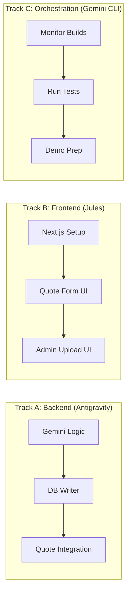

# 🚀 Sprint Mission: Working Prototype

**Goal**: A clickable demo that lets user upload a rate sheet and see a quote.
**Timeline**: ~3 Hours Parallel Execution

---

## Execution Order (Parallel Tracks)



---

## 🧠 [Antigravity] Backend Logic (START NOW)

```markdown
**MISSION**: Complete the Gemini Extraction Pipeline
**PRIORITY**: CRITICAL PATH

**TASKS**:
1. Create `ratesheets/services/processors/gemini.py`
   - Use `google.generativeai` to send PDF text to Gemini
   - Define JSON Schema for extraction (FICO/LTV grid)
   - Parse response into dict

2. Update `ratesheets/services/ingestion.py`
   - Take Gemini JSON, create RateAdjustment records
   - Use `get_or_create` for LenderProgramOffering
   - Wrap in transaction.atomic()

3. Update `ratesheets/tasks.py`
   - Use GeminiProcessor if API key exists, else fallback to PdfPlumber

**VERIFICATION**: Run `docker compose exec backend python manage.py test ratesheets`
```

---

## 🏗️ [Jules] Frontend Foundation

```markdown
**MISSION**: Build the Quote Calculator UI
**CONTEXT**: We have a Next.js skeleton. Make it look like a mortgage site.

**TASKS**:
1. **Quote Form** (`frontend/app/quote/page.tsx`)
   - Fields: Loan Amount, LTV, FICO, Property Type
   - Submit to `POST /api/v1/quote/`
   - Display: Rate, Points, APR

2. **Styling** (`frontend/app/globals.css`)
   - Dark theme with blue accents (professional mortgage look)
   - Responsive layout

3. **Verification**: Run `npm run dev` and screenshot the form

**CONSTRAINTS**:
- Do NOT touch backend code
- Use fetch() for API calls
- Handle loading/error states
```

---

## 🎯 [Gemini CLI] Orchestration

```markdown
**MISSION**: Monitor and Coordinate
**TASKS**:
1. Watch Docker logs for errors: `docker compose logs -f backend`
2. After Antigravity commits, run integration tests
3. After Jules commits, verify frontend builds: `cd frontend && npm run build`
4. Prepare demo script (curl commands, screenshots)
```

---

## ✅ Success Criteria

1. User can visit `localhost:3000/quote` and see a form
2. User can POST to `/api/v1/quote/` and get a JSON response
3. User can upload a PDF in Admin, status changes to "processed", RateAdjustments appear
