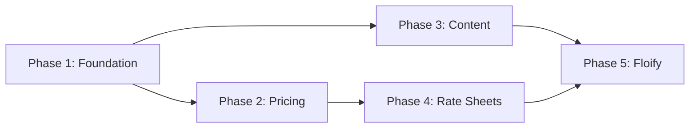

# Conductor Tracks - Unified CMTG Platform

> **Purpose**: This file defines all workflow tracks for the Unified CMTG Platform. Each track represents a major workstream that can be executed by AI agents.

---

## 🎯 Track Overview

| Track | Phase | Status | Description |
|-------|-------|--------|-------------|
| [Foundation](./tracks/phase1_foundation/) | 1 | 🟡 In Progress | Legacy verification, project setup |
| [Pricing Engine](./tracks/phase2_pricing/) | 2 | ⏳ Pending | Port cmtgdirect logic |
| [Content Migration](./tracks/phase3_content/) | 3 | ⏳ Pending | WordPress → Wagtail |
| [Rate Sheet Agent](./tracks/phase4_ratesheet/) | 4 | ⏳ Pending | PDF extraction pipeline |
| [Floify Integration](./tracks/phase5_floify/) | 5 | ⏳ Pending | Lead capture, webhooks |

---

## 📋 How to Use Tracks

### Starting a Track
```bash
# Via slash command (when integrated)
/conductor start phase1_foundation

# Or manually invoke the plan.md
cat conductor/tracks/phase1_foundation/plan.md
```

### Track Structure
Each track folder contains:
```
tracks/phase1_foundation/
├── plan.md          # Detailed task breakdown
├── context.md       # Background knowledge for agents
└── checklist.md     # Progress tracking
```

---

## 🤖 Agent Assignments

| Track | Primary Agent | Support Agents |
|-------|---------------|----------------|
| Foundation | QA Tester | Pricing Engineer |
| Pricing Engine | Pricing Engineer | QA Tester |
| Content Migration | Wagtail Expert | Frontend Architect |
| Rate Sheet Agent | Rate Sheet Agent | Pricing Engineer |
| Floify Integration | Frontend Architect | Pricing Engineer |

---

## 🔗 Dependencies



---

## 📊 Current Status

**Active Track**: Phase 1 - Foundation & Legacy Verification

**Last Updated**: 2026-01-11
