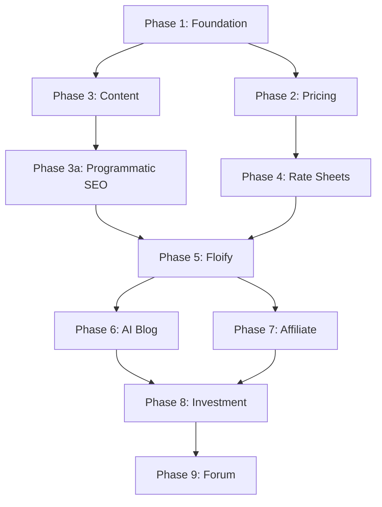

# Conductor Tracks - Unified CMTG Platform

> **Purpose**: Workflow tracks for AI agents. Each track = major workstream.  
> **Rule**: Task complete only when tests pass ✅

---

## 🎯 Track Overview

| Track | Phase | Week | Status | Description |
|-------|-------|------|--------|-------------|
| [Port Legacy Pricing Engine & Implement Rate Sheet Ingestion MVP](./tracks/port_pricing_ratesheet_20260112/) | 1-4 | 1-4 | ✅ Complete | Core pricing logic & AI agent MVP |
| **[Production Finalization - Content & SEO](./tracks/finalization_20260114/)** | **F.1-F.10** | **Current** | 🔴 **ACTIVE** | **Content migration + Programmatic SEO engine** |
| [Foundation](./tracks/phase1_foundation/) | 1 | 1 | ✅ Complete | Docker + Django + Wagtail |
| [Pricing Engine](./tracks/phase2_pricing/) | 2 | 2 | ✅ Complete | Port cmtgdirect logic |
| [Content Migration](./tracks/phase3_content/) | 3 | 3 | 🔄 In Finalization | WordPress → Wagtail (see F.1-F.3) |
| [Programmatic SEO](./tracks/phase3a_seo/) | 3a | 4 | 🔄 In Finalization | 10K+ local pages (see F.4-F.6) |
| [Rate Sheet Agent](./tracks/phase4_ratesheet/) | 4 | 5 | ✅ Complete | PDF extraction |
| [Floify Integration](./tracks/phase5_floify/) | 5 | 6 | 🔄 In Finalization | Lead capture (see F.8) |
| [AI Blog](./tracks/phase6_blog/) | 6 | 7-8 | ⏳ Post-Launch | NotebookLM + content |
| [Affiliate Program](./tracks/phase7_affiliate/) | 7 | 9 | ⏳ Post-Launch | Referral tracking |
| [Investment Waitlist](./tracks/phase8_investment/) | 8 | 10 | ⏳ Post-Launch | Coming soon MVP |
| [Community Forum](./tracks/phase9_forum/) | 9 | 11-12 | ⏳ Deferred | Forum engine |

---

## 🔴 Current Priority

**Active Track**: Production Finalization - Content Migration & Programmatic SEO  
**Track ID**: `finalization_20260114`  
**Next Task**: Jules - F.1: Create Wagtail CMS models (ProgramPage, 64 ACF fields)  
**Status**: Ready to start - awaiting user approval

---

## 🤖 Agent Assignments

| Track | Primary Agent | Support |
|-------|---------------|---------|
| Foundation | QA Tester | Pricing Engineer |
| Pricing Engine | Pricing Engineer | QA Tester |
| Content Migration | Wagtail Expert | Frontend Architect |
| Programmatic SEO | Wagtail Expert | Rate Sheet Agent |
| Rate Sheets | Rate Sheet Agent | Pricing Engineer |
| Floify | Frontend Architect | Pricing Engineer |
| AI Blog | Content Agent | Marketing Automation |
| Affiliate | Marketing Agent | Pricing Engineer |
| Investment | Research Agent | Legal |
| Forum | Frontend Architect | Moderation Agent |

---

## 🔗 Dependencies



---

## 📋 How to Use

### Start a Track
```bash
/conductor start port_pricing_ratesheet_20260112
```

### Track Structure
```
tracks/port_pricing_ratesheet_20260112/
├── plan.md          # Task breakdown + tests
├── spec.md          # Track specification
├── metadata.json    # Track metadata
└── checklist.md     # Progress tracking
```

---

## 📊 Research Tasks Queue

| Task | Priority | Status |
|------|----------|--------|
| Best affordable RE API | High | ⏳ Pending |
| Affiliate disclaimer | High | ⏳ Pending |
| Misago alternatives | Medium | ⏳ Pending |
| DST 1031 structure | Medium | ⏳ Pending |

---

**Last Updated**: 2026-01-14 10:36 PST

