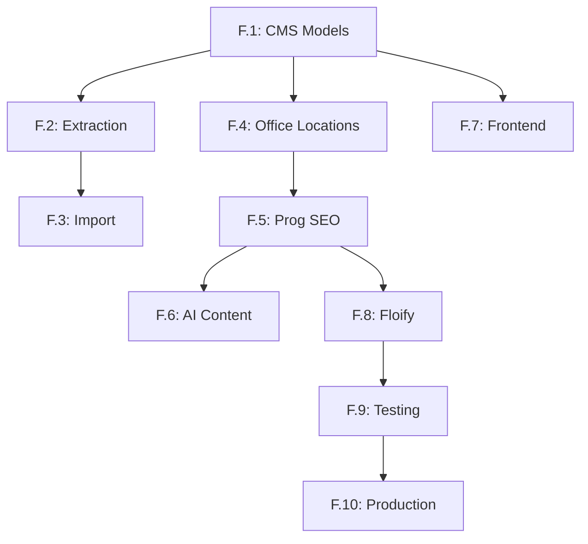

# Conductor Tracks - Unified CMTG Platform

> **Purpose**: Workflow tracks for AI agents. Each track = major workstream.  
> **Rule**: Task complete only when tests pass ✅

---

## 🎯 Track Overview

| Track | Phase | Week | Status | Description |
|-------|-------|------|--------|-------------|
| [Finalization Track (F.1-F.10)](./tracks/finalization_track/) | F.1-F.10 | Current | 🔴 Active | **Master Track for v2.0 Launch** |
| [Port Legacy Pricing Engine](./tracks/port_pricing_ratesheet_20260112/) | 1 | 1 | 🟡 Merged | Core pricing logic & AI agent MVP |
| [Foundation](./tracks/phase1_foundation/) | 1 | 1 | ✅ Done | Docker + Django + Wagtail |
| [Pricing Engine](./tracks/phase2_pricing/) | 2 | 2 | ✅ Done | Port cmtgdirect logic |
| [Content Migration](./tracks/phase3_content/) | 3 | 3 | ➡️ To F.1-F.3 | Integrated into Finalization Track |
| [Programmatic SEO](./tracks/phase3a_seo/) | 3a | 4 | ➡️ To F.5 | Integrated into Finalization Track |
| [Rate Sheet Agent](./tracks/phase4_ratesheet/) | 4 | 5 | ➡️ To F.8 | Integrated into Finalization Track |
| [Floify Integration](./tracks/phase5_floify/) | 5 | 6 | ➡️ To F.8 | Integrated into Finalization Track |
| [AI Blog](./tracks/phase6_blog/) | 6 | Post-Launch | ⏳ Deferred | NotebookLM + content |
| [Affiliate Program](./tracks/phase7_affiliate/) | 7 | Post-Launch | ⏳ Deferred | Referral tracking |
| [Investment Waitlist](./tracks/phase8_investment/) | 8 | Post-Launch | ⏳ Deferred | Coming soon MVP |
| [Community Forum](./tracks/phase9_forum/) | 9 | Post-Launch | ⏳ Deferred | Forum engine |

---

## 🔴 Current Priority

**Active Track**: Finalization Track (F.1 - F.10)
**Next Task**: F.1 - Wagtail CMS Models Implementation

---

## 🤖 Agent Assignments

| Track | Primary Agent | Support |
|-------|---------------|---------|
| Finalization Track | Jules | Ralph (Verification) |

---

## 🔗 Dependencies



---

## 📋 How to Use

### Start a Track
```bash
/conductor start finalization_track
```

### Track Structure
```
tracks/finalization_track/
├── plan.md          # Task breakdown + tests
├── checklist.md     # Progress tracking
```

---

**Last Updated**: 2026-01-14

