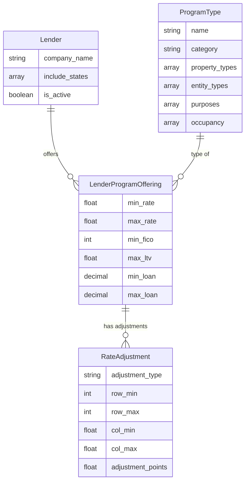

# Legacy Pricing Logic Analysis

**Track**: `port_pricing_ratesheet_20260112`  
**Created**: 2026-01-14

---

## Overview

This document analyzes the legacy `get_matched_loan_programs_for_qual()` function from `cmtgdirect/loans/queries.py` and confirms its successful porting to the new `unified-platform/backend/pricing/services/matching.py`.

---

## Legacy Function: `get_matched_loan_programs_for_qual()`

### Location
`legacy_cmtgdirect/loans/queries.py`

### Purpose
Finds matching `LenderProgramOffering` objects for a given borrower qualification.

### Input
`QualifyingInfo` object containing:
| Field | Type | Description |
|-------|------|-------------|
| `property_type` | string | Type of property (residential, commercial, etc.) |
| `entity_type` | string | Borrowing entity (individual, llc, etc.) |
| `purpose` | string | Loan purpose (purchase, refinance, etc.) |
| `occupancy` | string | Occupancy type (owner_occupied, investment, etc.) |
| `state` | string | Property state (2-letter code) |
| `loan_amount` | float | Requested loan amount |
| `ltv` | float | Loan-to-value ratio (percentage) |
| `estimated_credit_score` | int | Borrower's FICO score |

### Filter Logic

```python
filters = {
    # ProgramType criteria (via FK)
    'program_type__property_types__contains': [qi.property_type],
    'program_type__entity_types__contains': [qi.entity_type],
    'program_type__purposes__contains': [qi.purpose],
    'program_type__occupancy__contains': [qi.occupancy],
    
    # Lender geographic eligibility
    'lender__include_states__contains': [qi.state],
    
    # Numeric limits on LenderProgramOffering
    'min_loan__lte': qi.loan_amount,          # Amount >= min
    'max_loan__gte': qi.loan_amount,          # Amount <= max
    'max_ltv__gte': qi.ltv,                   # LTV within lender limit
    'min_fico__lte': qi.estimated_credit_score,  # FICO meets requirement
    
    # Status filter
    'is_active': True
}
```

### Output
`QuerySet[LenderProgramOffering]` ordered by `min_rate` (ascending).

---

## Ported Implementation

### Location
`backend/pricing/services/matching.py`

### Status
✅ **COMPLETE** - Fully functional

### Enhancements Over Legacy

1. **`LoanMatchingService` Class**  
   Provides a clean service interface:
   - `match_programs()` - Core matching
   - `get_best_rates()` - Top N results
   - `get_adjusted_rate()` - Apply FICO/LTV adjustments
   - `get_quotes_with_adjustments()` - Full pricing with adjustments

2. **Rate Adjustments**  
   Added `RateAdjustment` support via:
   ```python
   fico_ltv_adjustments = RateAdjustment.objects.filter(
       offering=offering,
       adjustment_type=RateAdjustment.ADJUSTMENT_TYPE_FICO_LTV,
       row_min__lte=fico,
       row_max__gte=fico,
       col_min__lte=ltv,
       col_max__gte=ltv
   )
   ```

3. **Optimized Queries**  
   Added `select_related()` for efficient joins:
   ```python
   .select_related('lender', 'program_type')
   ```

---

## Model Relationships



---

## API Integration

The ported logic is exposed via `QuoteView` in `api/views.py`:

```python
# POST /api/v1/quote/
{
    "property_state": "CA",
    "loan_amount": 500000,
    "credit_score": 720,
    "property_value": 625000,
    "property_type": "residential",
    "entity_type": "individual",
    "loan_purpose": "purchase",
    "occupancy": "owner_occupied"
}
```

Response includes:
- `quotes[]` - Array of matching programs with adjusted rates
- `ltv` - Calculated LTV
- `matches_found` - Total count

---

## Verification

| Aspect | Status |
|--------|--------|
| Core filter logic ported | ✅ Verified |
| `QualifyingInfo` class | ✅ Ported |
| `get_matched_loan_programs_for_qual()` | ✅ Functional |
| `LoanMatchingService` | ✅ Implemented |
| Rate adjustments | ✅ Implemented |
| API endpoint | ✅ `/api/v1/quote/` |
| Frontend integration | ✅ Quote Wizard |

---

## Conclusion

The legacy pricing logic has been **successfully ported** with enhancements:
1. Clean service architecture
2. FICO/LTV adjustment support
3. REST API integration
4. Frontend integration via Quote Wizard

No further porting work is required for the core matching logic.
